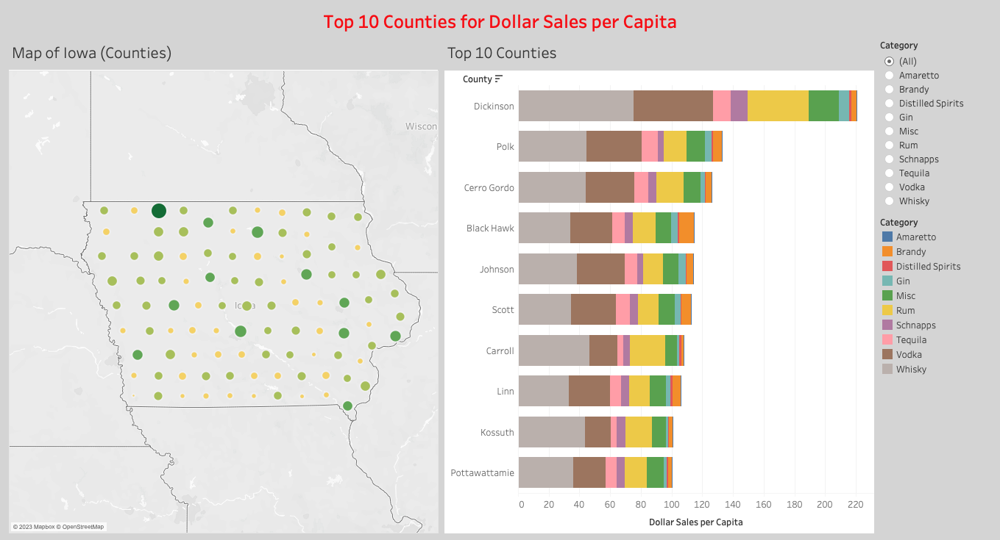
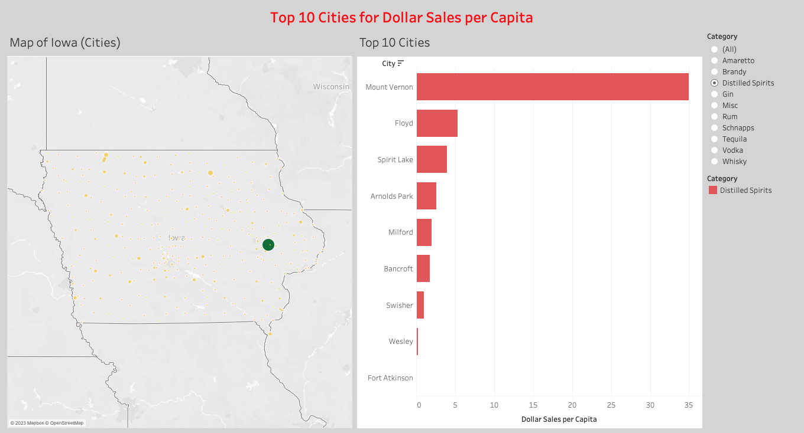

# Team_1 - Checkpoint_2.0

# Introduction 
The analysis within this report is intended to inform and better equip the marketing manager of an alcohol distributor, operating in Iowa. An analysis of per capita sales across regions of Iowa will demonstrate where consumption of alcohol is highest, differentiated between different alcohol categories. This will allow the marketing manager to better allocate marketing material to regions where they can be most effective in increasing sales. 

# Data Summary
The data analyzed in this report contains sales data from 2012 to 2016, measuring both dollar sales and volume sales, and demographic data for all regions of Iowa. (General ACS and Sales data analysis and visualization here)

Across City and County level, the sales data projected similar pattern as Whisky, Vodka and Rum dominated the most part of the sales, followed by Misc, Tequila, Brandy, Schnapps, Gin, etc. The rankings acroos the top 10 counties with most sales in dollars and most sales in volume stayed constant, with Polk, Linn and Scott county taking the first three across dollar sale and volume sale.
City sales saw identical ranking in popularity of product categories. However, there is change of ranking between sale in dollar and sale in volume. Cities including Waterloo, Iowa city and West Des Moines swtiched places, the reason of this swtich in places could due to the fact that Vodka's retail prices are lower but sold in greater volume, hence causing the change in ranking, besides this, the pattern of the city level analysis stayed constant with the county level.

# Data Analytics

## Research Question 2: 
## Top 10 geographies for per capita consumption across every liquor category

### County Level
library(dplyr)
library(tidyr)

merged_data_counties <- read.csv("merged_counties.csv")

grouped_data_counties <- merged_data_counties %>% 

  group_by(county, category) 

#### Calculate total population and sale volume by County and category

summarized_data <- grouped_data_counties %>% 

  summarize(total_population = sum(population),
  
            total_sale_volume = sum(sale.volume))

#### Calculate per capita consumption by dividing total sale volume by total population

per_capita_data <- summarized_data %>% 

  mutate(per_capita_consumption = total_sale_volume / total_population)

#### Rank geographies by per capita consumption across all categories

counties_ranked_data <- per_capita_data %>% 

  group_by(category, county) %>% 
  
  summarize(avg_per_capita_consumption = mean(per_capita_consumption)) %>% 
  
  arrange(category, desc(avg_per_capita_consumption)) %>% 
  
  group_by(category) %>% 
  
  slice(1:10)

#### View the top 10 geographies with highest per capita consumption across all categories

counties_ranked_data

### City level

merged_data_cities <- read.csv("merged_cities.csv")

grouped_data_cities <- merged_data_cities %>% 

  group_by(city, category) 

#### Calculate total population and sale volume by City and category

summarized_data <- grouped_data_cities %>% 

  summarize(total_population = sum(population),
  
            total_sale_volume = sum(sale.volume))
            
#### Calculate per capita consumption by dividing total sale volume by total population

per_capita_data <- summarized_data %>% 

  mutate(per_capita_consumption = total_sale_volume / total_population)
  
#### Rank geographies by per capita consumption across all categories
cities_ranked_data <- per_capita_data %>% 

  group_by(category, city) %>% 
  
  summarize(avg_per_capita_consumption = mean(per_capita_consumption)) %>% 
  
  arrange(category, desc(avg_per_capita_consumption)) %>% 
  
  group_by(category) %>% 
  
  slice(1:10)

#### View the top 10 cities with highest per capita consumption across all categories
cities_ranked_data

### Zipcode Level

merged_data_zipcodes <- read.csv("merged_zipcodes.csv")

grouped_data_zipcodes <- merged_data_zipcodes %>% 

  group_by(zipcode, category) 

#### Calculate total population and sale volume by zipcode and category

summarized_data <- grouped_data_zipcodes %>% 

  summarize(total_population = sum(population),
  
            total_sale_volume = sum(sale.volume))
            
#### Calculate per capita consumption by dividing total sale volume by total population

per_capita_data <- summarized_data %>% 

  mutate(per_capita_consumption = total_sale_volume / total_population)
  
#### Rank geographies by per capita consumption across all categories

zipcodes_ranked_data <- per_capita_data %>% 

  group_by(category, zipcode) %>% 
  
  summarize(avg_per_capita_consumption = mean(per_capita_consumption)) %>% 
  
  arrange(category, desc(avg_per_capita_consumption)) %>% 
  
  group_by(category) %>% 
  
  slice(1:10)
  
  
#### View the top 10 zipcodes with highest per capita consumption across all categories

zipcodes_ranked_data

### Top 10 geographies per capita dollar sales across all categories:

### Top 10 Cities:

### Top 10 Counties:

### Top 10 Zipcodes:

### Outlier Analysis:

When examining the top cities for every alcohol category, a particular city stood out for sales of distilled spirits. In Mount Vernon, there is a much higher sale of distilled spirits per capita than in any other city in the state by some margin. This is demonstrated in the screenshot below:

## Conclusion
(in the works)

## Policy Recommendation
(in the works)
